# Aktivace výukového účtu
- - -
<!-- #activateaccount -->
Přejděte na [https://portal.azure.com](https://portal.azure.com).
- - -
Přihlašte se jménem a heslem, které jste dostali s informacemi o školení.
- - -
Po přihlášení budete vyzváni ke změně hesla. Nastavte si nové heslo.
- - -
Budete vyzváni k nastavení dvoufaktorové autentizace. Podle návodu použijte Microsoft Authenticator nebo jinou 2FA aplikaci.
- - -
## Povolení managementu Azure
- - -
Klepněte na ikonu menu v levé horní části obrazovky a zvolte _Microsoft Entra ID_.

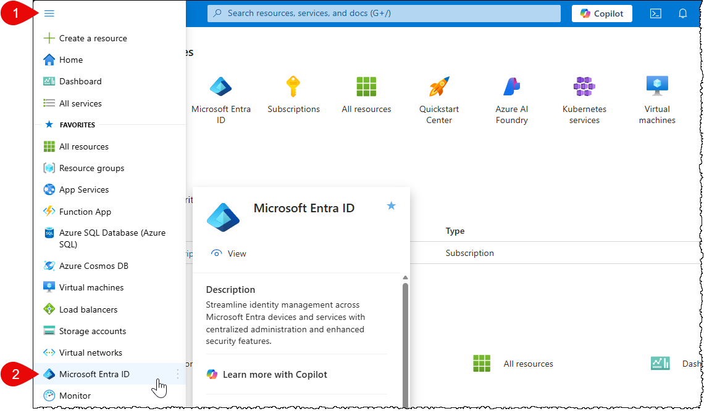
- - -
Klepněte v levém menu na _Manage_ a _Properties_. Zaškrtněte _Access management for Azure Resources_. Poté klepněte na _Save_.

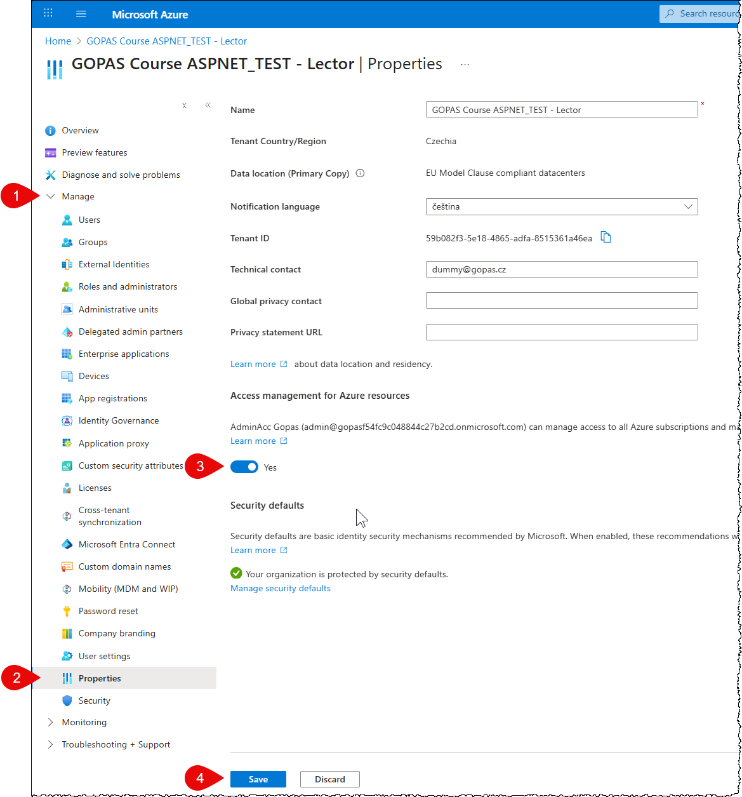
- - -
Odhlašte se.

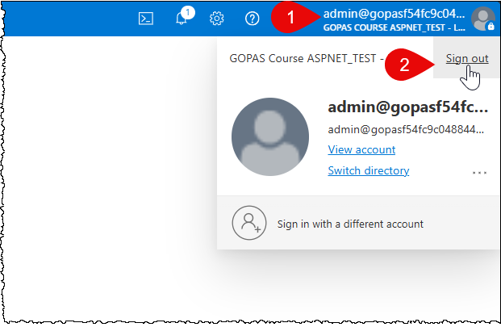
- - -
## Povolení managementu subscription
- - -
Znovu se přihlašte, pomocí nového hesla a autentizační aplikace, kterou jste nastavili.
- - -
Klepněte na _Subscriptions_.

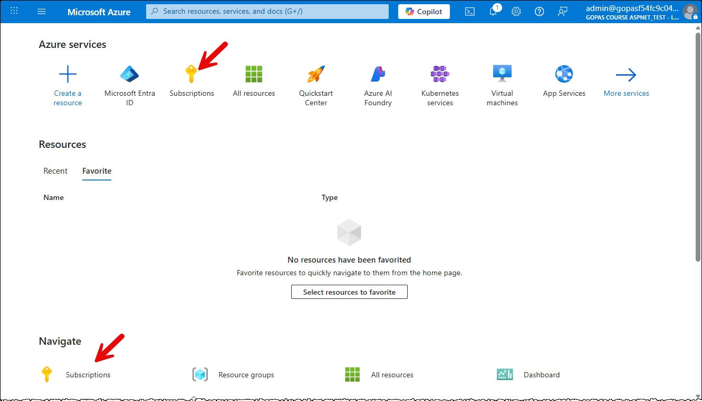
- - -
Vyberte svou subscription.

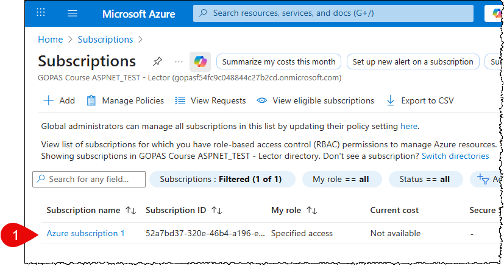
- - -
Klepněte na _Access control (IAM)_ a poté na _Add_ a _Add role assignment_.

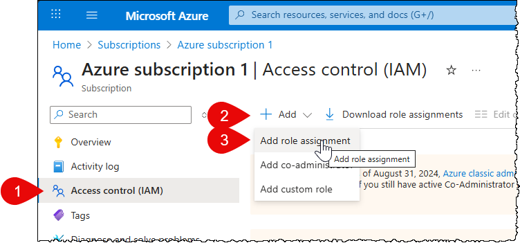
- - -
Vyberte _Privileged administrator roles_, poté zvolte roli _Owner_ a klepněte na _Next_.

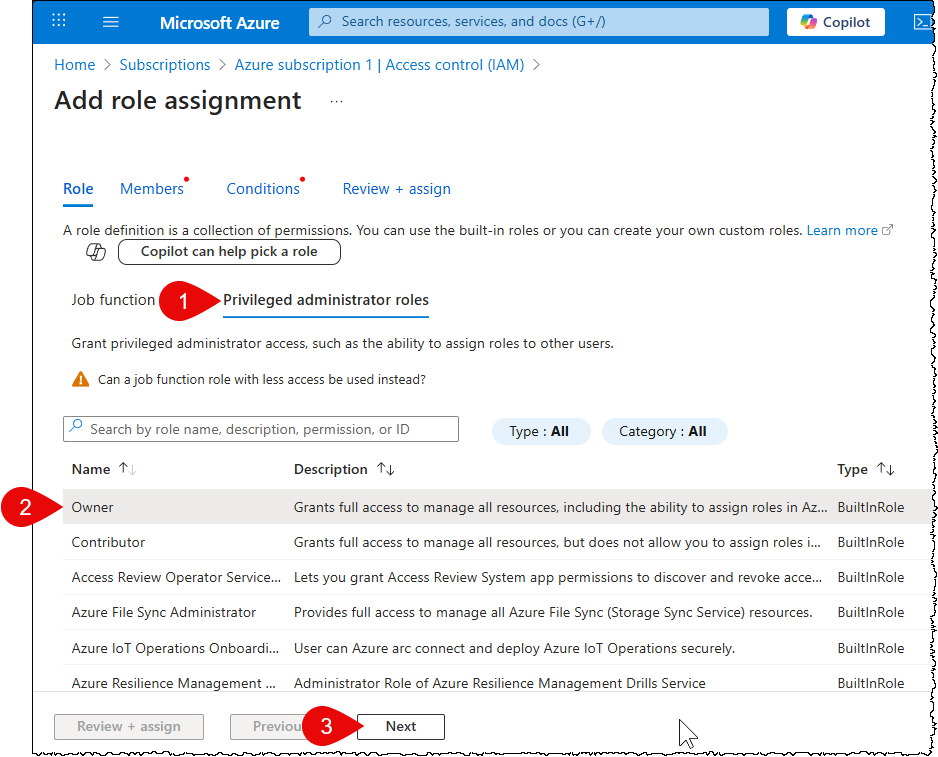
- - -
Klepněte na _Select members_, vyberte svého uživatele, klepněte na _Select_ a _Next_.

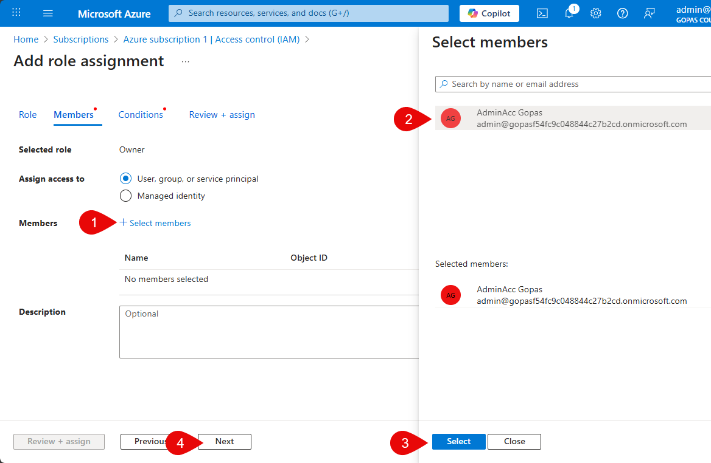
- - -
Zvolte _Allow user to assign all roles_ a klepněte na _Review + assign_.

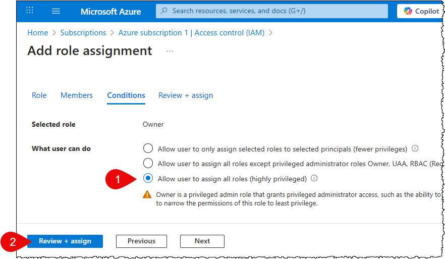
- - -
Znovu potvrďte klepnutím na _Review + assign_.

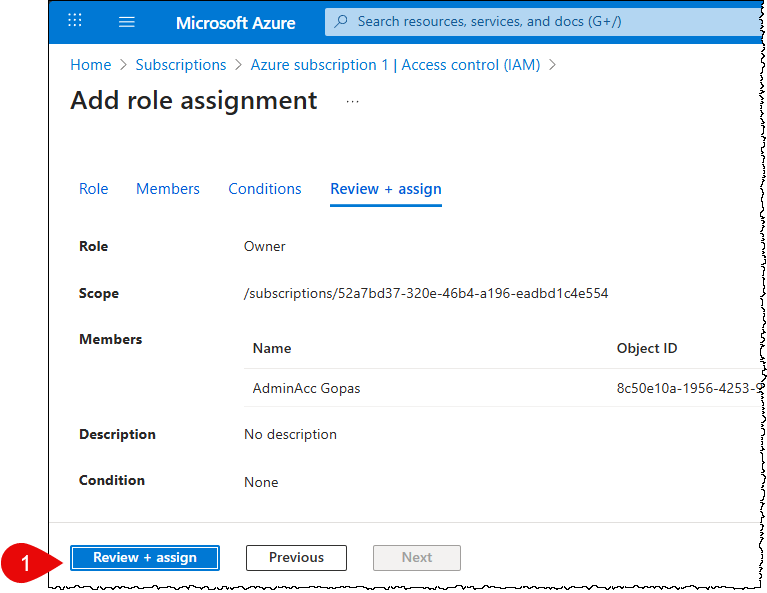
- - -
Odhlašte se.

- - -
## Pojmenování subscription
- - -
Znovu se přihlašte, pomocí nového hesla a autentizační aplikace, kterou jste nastavili.
- - -
Klepněte na _Subscriptions_.

- - -
Vyberte svou subscription.

- - -
Klepněte na _Rename_.

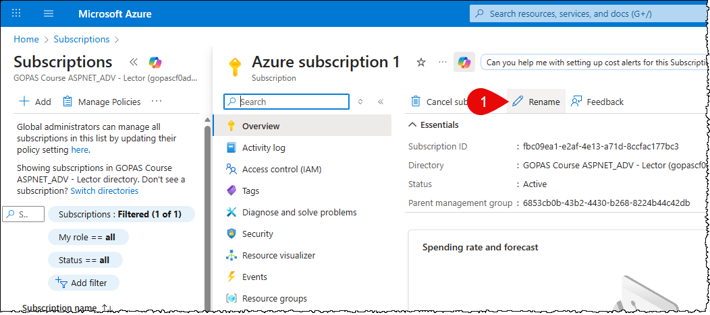
- - -
Zadejte jako název subscription ID kurzu, kterého se účastníte a klepněte na _Save_.

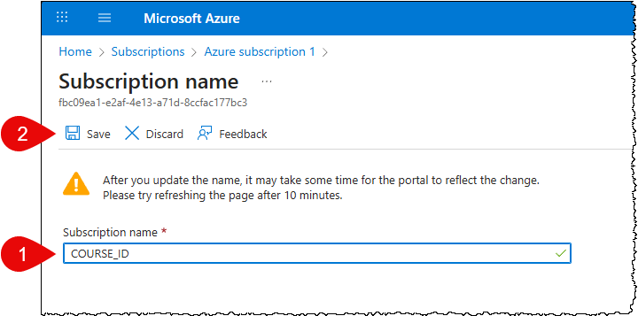
- - -
Tímto bylo nastavení účtu úspěšně dokončeno a můžete ho začít používat.
